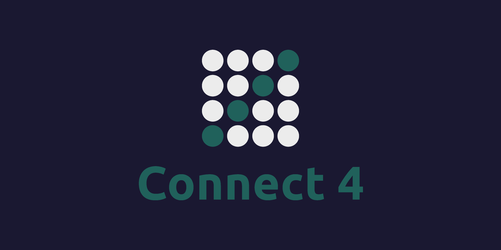

# Connect 4: Python Edition 🔴 🟡

  

  A sleek, lightweight, purely Python-based implementation of the classic Connect 4 board game. Built using Tkinter, this desktop application offers a smooth graphical interface featuring both offline local multiplayer and an automated AI opponent.

  

---

## ✨ Features

* **Dual Game Modes:**
  * **Player vs Player (Local):** Pass and play with a friend on the same machine.
  * **Player vs AI:** Test your skills against an automated decision-making AI player.
* **Zero Dependencies:** Built entirely using Python's native standard libraries—no external installations or complex environments required.
* **Persistent Data Management:** Utilizes secure, structured JSON local file handling to manage and save your essential game configurations and state data seamlessly across sessions.

## 🎮 How to Play

1. The game is played on a standard **7x6 grid**.
2. Players take turns dropping their designated pieces (Red or Yellow) into one of the 7 columns.
3. The piece will fall to the lowest available space within the chosen column.
4. The first player to align **4 of their pieces** vertically, horizontally, or diagonally wins the game!
5. If the board fills up completely before either player achieves a Connect 4, the match ends in a draw.

---

## 🚀 Getting Started

You can either download the pre-compiled standalone executable to play instantly, or run the source code directly.

### Option 1: Standalone Download (Recommended)
1. Click the **Download Latest Release** badge at the top of this page.
2. Download the compressed `.zip` bundle from the assets section.
3. Extract the folder and double-click `Connect Four Game.exe` to launch the game immediately.

### Option 2: Running from Source
If you prefer to run or modify the Python source code, ensure you have Python 3 installed.
